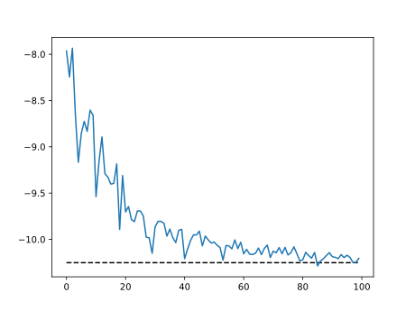

<h1 align='center'>Quantax</h1>

<p align="center">
  <strong>Flexible and scalable neural quantum states built on JAX</strong>
</p>

<p align="center">
  <a href="https://chenao-phys.github.io/quantax">📖 Documentation</a>
</p>

---


## 🔍Scope

Quantax is a research-oriented Python package for quantum many-body physics, with a focus on flexible and scalable neural quantum states (NQS). Apart from NQS, Quantax also includes several useful techniques in variational Monte Carlo (VMC):

- Exact diagonalization and small-system benchmarks via [QuSpin](https://github.com/QuSpin/QuSpin)
- Fermionic mean-field wavefunctions
- Flexible (neural) wavefunction design via [Equinox](https://github.com/patrick-kidger/equinox)
- Tensor networks via [quimb](https://github.com/jcmgray/quimb/tree/main) and [symmray](https://github.com/jcmgray/symmray) (to be implemented)

## ⚙️Installation

Requires Python 3.10+, JAX 0.6.1+

First, ensure that a correct JAX version is installed. For details, check [JAX Installation](https://docs.jax.dev/en/latest/installation.html).

For a direct installation of full functionality (recommended in most cases),
```bash
pip install quantax[full]
```

For a minimal installation,
```bash
pip install quantax
```


## 🚀Quick Start

```python
import quantax as qtx
import matplotlib.pyplot as plt

# Define a spin chain with 8 spins, stored as a global object in quantax
lattice = qtx.sites.Chain(L=8)

# Ising hamiltonian with transverse field h=1
H = qtx.operator.Ising(h=1)

# Exact diagonalization
E, wf = H.diagonalize()

# RBM wavefunction with 16 hidden units
model = qtx.model.RBM_Dense(features=16)

# Construct variational state
state = qtx.state.Variational(model)

# Sampler with local flip updates
sampler = qtx.sampler.LocalFlip(state, nsamples=64)

# Stochastic reconfiguration optimizer
optimizer = qtx.optimizer.SR(state, H)

energy_data = qtx.utils.DataTracer()
for i in range(100):
    samples = sampler.sweep()
    step = optimizer.get_step(samples)
    state.update(step * 1e-2)
    energy_data.append(optimizer.energy)

energy_data.plot(baseline=E)
plt.show()
```

